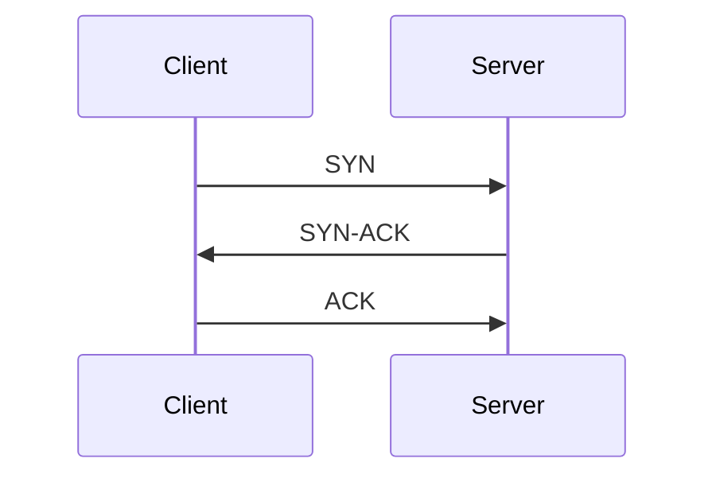

# minjune8506.github.io

GitHub Pages + Jekyll로 만든 기술 블로그입니다.

## 로컬에서 실행하기

```bash
bundle install
bundle exec jekyll serve
```

브라우저에서 http://localhost:4000 접속

## 새 글 작성

`_posts/YYYY-MM-DD-제목.md` 형식으로 파일을 추가합니다.

```yaml
---
layout: post
title: "글 제목"
date: YYYY-MM-DD HH:MM:SS +0900
categories: [카테고리]
tags: [태그1, 태그2]
---

본문 내용
```

## 시각 자료 넣기

### 이미지

`assets/images/posts/<포스트slug>/` 에 이미지를 넣고, caption이 필요하면 `figure.html`을 사용합니다.

```liquid

```

caption이 필요 없으면 그냥 마크다운 문법을 써도 됩니다: ``

### 다이어그램 (Mermaid)

시퀀스 다이어그램, 상태 다이어그램 등은 그림 파일 대신 Mermaid 코드로 작성합니다. front matter에 `mermaid: true`를 추가해야 스크립트가 로드됩니다.

```yaml
---
layout: post
title: "..."
mermaid: true
---
```

````markdown

````

TCP 상태머신 같은 건 `stateDiagram-v2`, 아키텍처 그림은 `flowchart` 문법을 사용하면 됩니다.

### 영상

작은 클립은 `assets/videos/`에 넣고 직접 임베드:

```html
<video controls>
  <source src="/assets/videos/파일.mp4" type="video/mp4">
</video>
```

용량이 크면 YouTube 등에 올리고 반응형 wrapper로 감쌉니다:

```html
<div class="video-embed">
  <iframe src="https://www.youtube.com/embed/VIDEO_ID" allowfullscreen></iframe>
</div>
```

## 배포

`main` 브랜치에 push하면 GitHub Actions(`.github/workflows/pages.yml`)가 자동으로 빌드/배포합니다.

최초 1회, GitHub 저장소의 **Settings → Pages → Build and deployment → Source**를 **GitHub Actions**로 설정해야 합니다.
