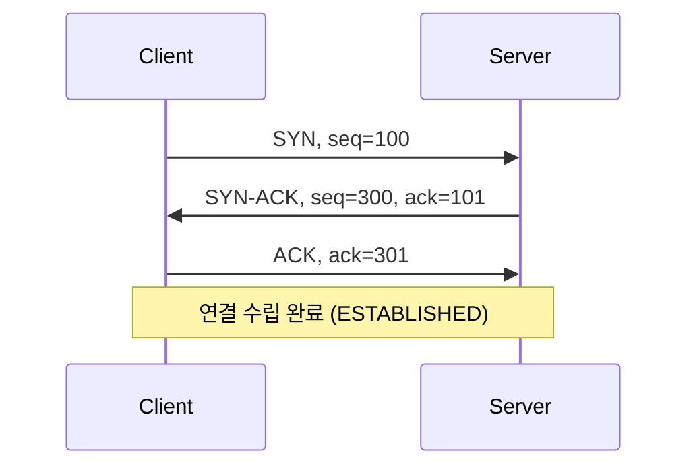
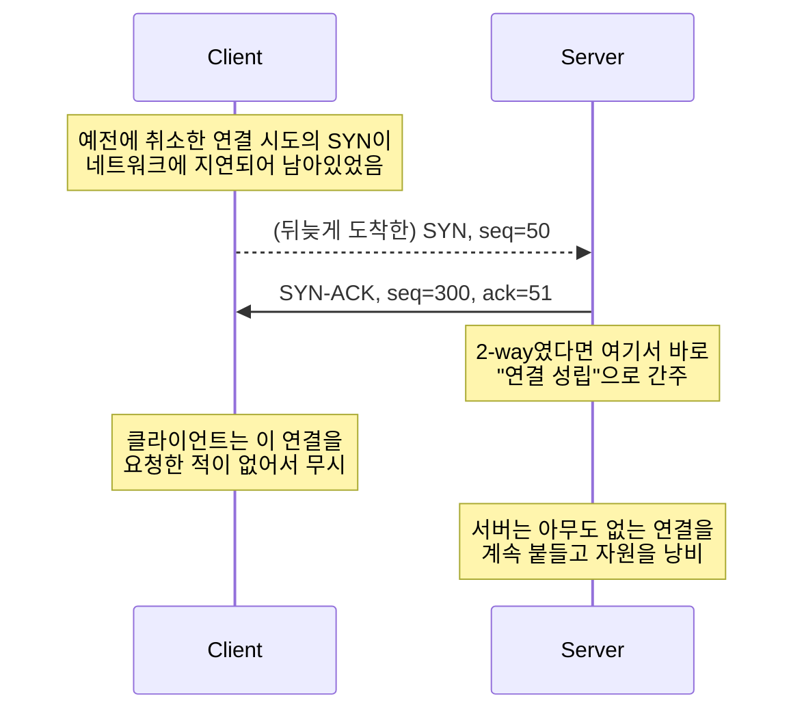

[지난 글]()에서 TCP 연결은 5-tuple로 식별된다고 했습니다. 이번 글은 그 연결이 실제로 어떻게 **맺어지는지**를 다룹니다. 다들 한 번쯤 들어봤을 "3-way handshake"입니다.

## 세 단계, 실제로 무슨 일이 일어나는가

말로만 "SYN, SYN-ACK, ACK"라고 외우면 금방 잊어버립니다. 실제로 어떤 값이 오가는지 숫자를 넣어서 봅시다.

각 단계가 하는 일은 이렇습니다.

1. **SYN**: 클라이언트가 "연결하고 싶다"는 요청과 함께, 자신이 앞으로 쓸 **초기 시퀀스 넘버(ISN)**를 제안합니다. 위 예시에서는 100입니다. (시퀀스 넘버가 왜 필요한지는 5편에서 다룹니다 — 지금은 "이 연결에서 내가 보내는 바이트에 매기는 일련번호의 시작점"이라고만 알면 됩니다.)
2. **SYN-ACK**: 서버가 두 가지를 동시에 합니다. 클라이언트의 SYN을 잘 받았다는 확인(`ack=101`, 즉 "100번을 받았으니 다음은 101번을 기다린다")과, 서버 자신의 ISN 제안(`seq=300`)을 한 세그먼트에 실어 보냅니다.
3. **ACK**: 클라이언트가 서버의 ISN을 잘 받았다는 확인(`ack=301`)을 보냅니다.

여기서 중요한 점: **세 번째 메시지가 도착해야 서버가 클라이언트의 존재를 확신합니다.** 서버는 SYN-ACK를 보낸 것만으로는 "내 메시지가 상대방에게 실제로 도착했는지" 알 방법이 없습니다. ACK가 와야 비로소 "아, 상대가 내 SYN-ACK를 받았구나"라고 확신할 수 있습니다.

## 왜 하필 세 번인가

당연히 드는 의문: "SYN, SYN-ACK만으로 끝내면 안 되나?" 2번이면 메시지 수가 줄어드니 더 효율적일 것 같습니다. 이게 왜 안 되는지, 사고실험으로 봅시다.

네트워크에서는 세그먼트가 지연되거나 중복될 수 있습니다. 예를 들어 클라이언트가 예전에 연결을 시도했다가 취소한 SYN이, 네트워크 어딘가에서 오래 떠돌다가 뒤늦게 서버에 도착하는 경우가 있을 수 있습니다. 만약 2-way였다면 어떻게 될까요.

2-way라면 서버는 SYN-ACK를 보내는 순간 "연결이 성립됐다"고 믿어버립니다. 하지만 이 SYN은 클라이언트가 이미 잊어버린 옛날 요청이므로, 클라이언트는 뜬금없이 도착한 SYN-ACK를 그냥 무시합니다. 결과적으로 서버만 아무도 없는 연결을 붙들고 자원(연결 상태, 버퍼)을 낭비하게 됩니다.

3-way에서는 이 문제가 없습니다. 클라이언트가 요청하지 않은 SYN-ACK에는 ACK를 보내지 않으므로(오히려 RST를 보내 "그런 연결 모른다"고 알립니다), 서버는 세 번째 메시지가 안 오는 걸 보고 그 연결을 성립시키지 않습니다. **세 번째 메시지는 "상대가 지금, 실제로, 이 연결을 원한다"는 걸 확인하는 절차**입니다.

## ISN은 왜 매번 다르게 정하는가

위 사고실험에서 이미 힌트가 나왔습니다. ISN을 매번 예측 불가능하게 무작위로 고르는 이유는 두 가지입니다.

- **옛 연결과 섞이지 않기 위해**: 같은 5-tuple로 새 연결을 맺을 때, 이전 연결에서 떠돌던 지연된 세그먼트가 새 연결의 데이터로 착각되지 않도록 시퀀스 넘버 범위를 다르게 시작합니다.
- **보안**: ISN을 예측할 수 있으면, 공격자가 남의 연결에 끼어들어 마치 정상적인 ACK를 보낸 것처럼 위장할 수 있습니다(TCP 세션 하이재킹). 그래서 실제 구현은 ISN을 단순 증가가 아니라 암호학적으로 예측 어렵게 생성합니다.

## SYN flood — 이 구조의 약점

3-way handshake는 서버에게 대가를 요구합니다. SYN을 받고 SYN-ACK를 보낸 순간부터, 서버는 ACK가 올 때까지 그 연결을 "half-open" 상태로 backlog 큐에 붙잡아 둬야 합니다. 이 큐 크기는 유한합니다.

<figure class="post-figure">
<svg viewBox="0 0 640 350" role="img" aria-label="공격자가 ACK를 보내지 않는 SYN을 대량으로 보내 backlog 큐를 half-open 상태로 가득 채우면, 정상 사용자의 SYN은 큐가 꽉 차서 거부된다." xmlns="http://www.w3.org/2000/svg">
  <defs>
    <marker id="tcp03-arrow" viewBox="0 0 10 10" refX="9" refY="5" markerWidth="6" markerHeight="6" orient="auto-start-reverse">
      <path d="M0,0 L10,5 L0,10 z" fill="currentColor"/>
    </marker>
  </defs>

  <text x="20" y="96" font-size="13" font-weight="600" fill="currentColor" font-family="sans-serif">공격자</text>
  <text x="20" y="114" font-size="11" fill="currentColor" fill-opacity="0.7" font-family="sans-serif">SYN 대량 발송</text>
  <text x="20" y="130" font-size="11" fill="currentColor" fill-opacity="0.7" font-family="sans-serif">(ACK는 절대 안 보냄)</text>
  <line x1="115" y1="140" x2="216" y2="140" stroke="currentColor" stroke-width="1.5" marker-end="url(#tcp03-arrow)"/>

  <rect x="220" y="20" width="260" height="260" fill="none" stroke="currentColor" stroke-width="1.5" rx="4"/>
  <text x="350" y="42" font-size="13" font-weight="600" fill="currentColor" font-family="sans-serif" text-anchor="middle">Backlog 큐 (용량 6)</text>

  <rect x="235" y="56" width="230" height="26" fill="none" stroke="currentColor" stroke-width="1.3" rx="3"/>
  <text x="350" y="74" font-size="11" fill="currentColor" fill-opacity="0.8" font-family="sans-serif" text-anchor="middle">가짜 IP #1 — 응답 대기중</text>

  <rect x="235" y="88" width="230" height="26" fill="none" stroke="currentColor" stroke-width="1.3" rx="3"/>
  <text x="350" y="106" font-size="11" fill="currentColor" fill-opacity="0.8" font-family="sans-serif" text-anchor="middle">가짜 IP #2 — 응답 대기중</text>

  <rect x="235" y="120" width="230" height="26" fill="none" stroke="currentColor" stroke-width="1.3" rx="3"/>
  <text x="350" y="138" font-size="11" fill="currentColor" fill-opacity="0.8" font-family="sans-serif" text-anchor="middle">가짜 IP #3 — 응답 대기중</text>

  <rect x="235" y="152" width="230" height="26" fill="none" stroke="currentColor" stroke-width="1.3" rx="3"/>
  <text x="350" y="170" font-size="11" fill="currentColor" fill-opacity="0.8" font-family="sans-serif" text-anchor="middle">가짜 IP #4 — 응답 대기중</text>

  <rect x="235" y="184" width="230" height="26" fill="none" stroke="currentColor" stroke-width="1.3" rx="3"/>
  <text x="350" y="202" font-size="11" fill="currentColor" fill-opacity="0.8" font-family="sans-serif" text-anchor="middle">가짜 IP #5 — 응답 대기중</text>

  <rect x="235" y="216" width="230" height="26" fill="none" stroke="var(--tcp-warn)" stroke-width="2" rx="3"/>
  <text x="350" y="234" font-size="11" fill="var(--tcp-warn)" font-family="sans-serif" text-anchor="middle">가짜 IP #6 — 응답 대기중 (큐 가득 참)</text>

  <rect x="20" y="290" width="160" height="40" fill="none" stroke="currentColor" stroke-width="1.5" rx="4"/>
  <text x="100" y="314" font-size="13" font-weight="600" fill="currentColor" font-family="sans-serif" text-anchor="middle">정상 사용자</text>

  <line x1="182" y1="305" x2="216" y2="290" stroke="var(--tcp-warn)" stroke-width="1.5"/>
  <line x1="196" y1="284" x2="212" y2="300" stroke="var(--tcp-warn)" stroke-width="2"/>
  <line x1="196" y1="300" x2="212" y2="284" stroke="var(--tcp-warn)" stroke-width="2"/>
  <text x="350" y="316" font-size="11" fill="var(--tcp-warn)" font-family="sans-serif" text-anchor="middle">SYN을 보냈지만 큐가 꽉 차서 거부됨</text>
</svg>
<figcaption>ACK를 절대 보내지 않는 가짜 SYN으로 backlog 큐를 채우면, 정상 사용자는 연결을 맺을 수 없다 — SYN flood 공격의 기본 원리.</figcaption>
</figure>

공격자가 ACK를 절대 보내지 않는 SYN을 backlog 큐 용량보다 많이 쏟아부으면, 큐가 half-open 상태로 가득 차서 정상 사용자의 SYN이 들어갈 자리가 없어집니다. 구체적인 방어 기법(SYN cookie 등)은 커널 구현을 다루는 심화편에서 살펴봅니다. 지금은 "handshake가 서버에게 상태 유지 비용을 요구하고, 그게 공격 지점이 될 수 있다"는 것만 기억하면 충분합니다.

## 다음 글

연결을 맺는 법을 봤으니, 다음 글에서는 그 연결 위에서 데이터가 실제로 어떻게 흐르는지 — 흐름제어(flow control)를 다룹니다.
