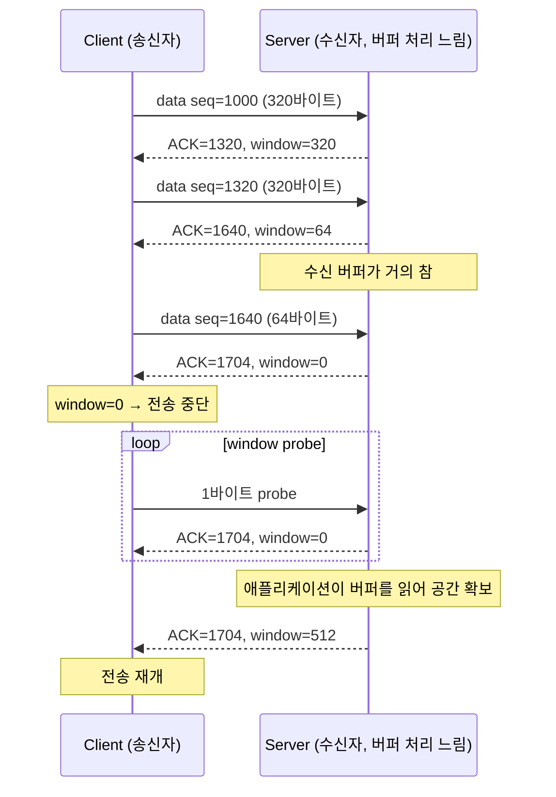

[지난 글]()에서 연결을 맺었습니다. 이제 데이터를 주고받을 차례인데, TCP는 한 번에 몽땅 보내지 않습니다. 왜 그런지, 그리고 얼마나 보낼지는 누가 정하는지를 봅니다.

## 왜 흐름제어가 필요한가

송신자가 수신자보다 훨씬 빠르게 데이터를 보낼 수 있는 상황을 생각해봅시다. 예를 들어 송신자는 고속 회선을 쓰는데, 수신자는 받은 데이터를 애플리케이션이 처리할 때까지 버퍼에 쌓아둬야 하고, 그 애플리케이션 처리 속도가 느리다면 어떻게 될까요. 수신자의 버퍼는 한정돼 있으므로, 송신자가 계속 밀어붙이면 버퍼가 넘쳐서 데이터를 버릴 수밖에 없습니다.

**흐름제어(flow control)**는 이 문제를 막습니다. 핵심 아이디어는 간단합니다: **수신자가 "나 지금 이만큼 더 받을 수 있어"라고 매번 알려주고, 송신자는 그 한도 안에서만 보낸다.**

## 슬라이딩 윈도우

이 "이만큼 더 받을 수 있다"는 정보가 **수신 윈도우(receive window, rwnd)**입니다. 송신자 입장에서 지금까지 보낸 데이터는 시퀀스 넘버 축 위에서 네 영역으로 나뉩니다.

<figure class="post-figure">
<svg viewBox="0 0 640 160" role="img" aria-label="시퀀스 넘버 축 위에서 데이터는 전송 완료(ACK 받음), 전송함-ACK 대기중, 전송 가능(window 안), 전송 불가(window 밖) 네 영역으로 나뉜다. 뒤의 두 영역을 합친 크기가 수신 윈도우다." xmlns="http://www.w3.org/2000/svg">
  <line x1="180" y1="50" x2="180" y2="58" stroke="var(--tcp-accent)" stroke-width="1.5"/>
  <line x1="460" y1="50" x2="460" y2="58" stroke="var(--tcp-accent)" stroke-width="1.5"/>
  <line x1="180" y1="50" x2="460" y2="50" stroke="var(--tcp-accent)" stroke-width="1.5"/>
  <text x="320" y="36" font-size="12" font-weight="600" fill="var(--tcp-accent)" font-family="sans-serif" text-anchor="middle">수신 윈도우 (rwnd = 320바이트)</text>

  <rect x="40" y="60" width="140" height="50" fill="none" stroke="currentColor" stroke-width="1.5"/>
  <text x="110" y="90" font-size="11" fill="currentColor" font-family="sans-serif" text-anchor="middle">ACK 받음</text>

  <rect x="180" y="60" width="140" height="50" fill="none" stroke="var(--tcp-accent)" stroke-width="2"/>
  <text x="250" y="82" font-size="11" fill="currentColor" font-family="sans-serif" text-anchor="middle">전송함</text>
  <text x="250" y="96" font-size="11" fill="currentColor" font-family="sans-serif" text-anchor="middle">ACK 대기중</text>

  <rect x="320" y="60" width="140" height="50" fill="none" stroke="var(--tcp-accent)" stroke-width="2"/>
  <text x="390" y="82" font-size="11" fill="currentColor" font-family="sans-serif" text-anchor="middle">전송 가능</text>
  <text x="390" y="96" font-size="11" fill="currentColor" font-family="sans-serif" text-anchor="middle">(window 안, 아직 안 보냄)</text>

  <rect x="460" y="60" width="140" height="50" fill="none" stroke="currentColor" stroke-width="1.5"/>
  <text x="530" y="82" font-size="11" fill="currentColor" font-family="sans-serif" text-anchor="middle">전송 불가</text>
  <text x="530" y="96" font-size="11" fill="currentColor" font-family="sans-serif" text-anchor="middle">(window 밖)</text>

  <text x="40" y="128" font-size="10" fill="currentColor" fill-opacity="0.6" font-family="sans-serif" text-anchor="middle">1000</text>
  <text x="180" y="128" font-size="10" fill="currentColor" fill-opacity="0.6" font-family="sans-serif" text-anchor="middle">1160</text>
  <text x="320" y="128" font-size="10" fill="currentColor" fill-opacity="0.6" font-family="sans-serif" text-anchor="middle">1320</text>
  <text x="460" y="128" font-size="10" fill="currentColor" fill-opacity="0.6" font-family="sans-serif" text-anchor="middle">1480</text>
  <text x="600" y="128" font-size="10" fill="currentColor" fill-opacity="0.6" font-family="sans-serif" text-anchor="middle">1640</text>
</svg>
<figcaption>송신자가 보는 시퀀스 넘버 축. ACK가 도착하면 왼쪽 두 영역의 경계가 오른쪽으로 밀리면서 "전송 가능" 영역이 새로 생긴다 — 이게 "슬라이딩" 윈도우라고 부르는 이유다.</figcaption>
</figure>

ACK가 도착할 때마다 "ACK 받음" 영역이 오른쪽으로 늘어나고, 그만큼 윈도우 전체가 오른쪽으로 밀립니다. 그래서 이름이 **슬라이딩** 윈도우입니다. 윈도우 크기(rwnd) 자체는 고정이 아니라, 수신자가 매 ACK마다 "지금 내 버퍼 여유가 이만큼이야"라고 새로 알려주는 값입니다.

## rwnd는 ACK와 함께 실시간으로 갱신된다

수신자의 버퍼가 애플리케이션 처리 속도를 못 따라가면 윈도우가 점점 줄어듭니다. 극단적으로 버퍼가 꽉 차면 윈도우는 0이 되고, 송신자는 전송을 멈춰야 합니다.

`window=0`을 받으면 송신자는 그냥 멈춥니다. 문제는 여기서 끝나면 안 된다는 겁니다 — 수신자가 나중에 버퍼를 비워서 "이제 받을 수 있어"라고 알리고 싶어도, 그 ACK 자체가 유실되면 송신자는 영원히 멈춘 채로 남습니다. 그래서 송신자는 주기적으로 **window probe**(1바이트짜리 작은 탐침 세그먼트)를 보내서 "아직도 0이야?"라고 물어봅니다. 수신자가 응답하면서 window 값을 실어 보내고, 그 값이 0보다 커지면 송신자는 전송을 재개합니다.

## 다음 글

흐름제어는 "얼마나 보낼지"를 조절합니다. 그런데 지금까지는 "보낸 데이터가 항상 무사히 도착한다"고 가정하고 이야기했습니다. 실제로는 중간에 유실될 수 있습니다. 다음 글에서는 TCP가 이 유실을 어떻게 알아채고 복구하는지 — 신뢰성 보장을 다룹니다.
