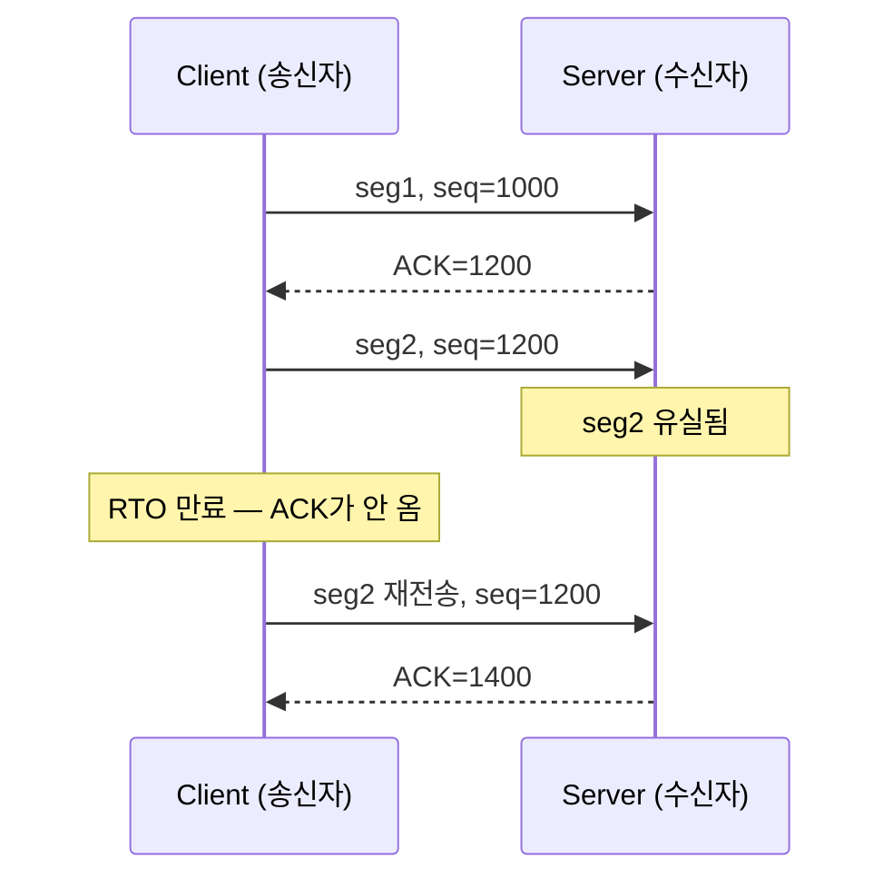
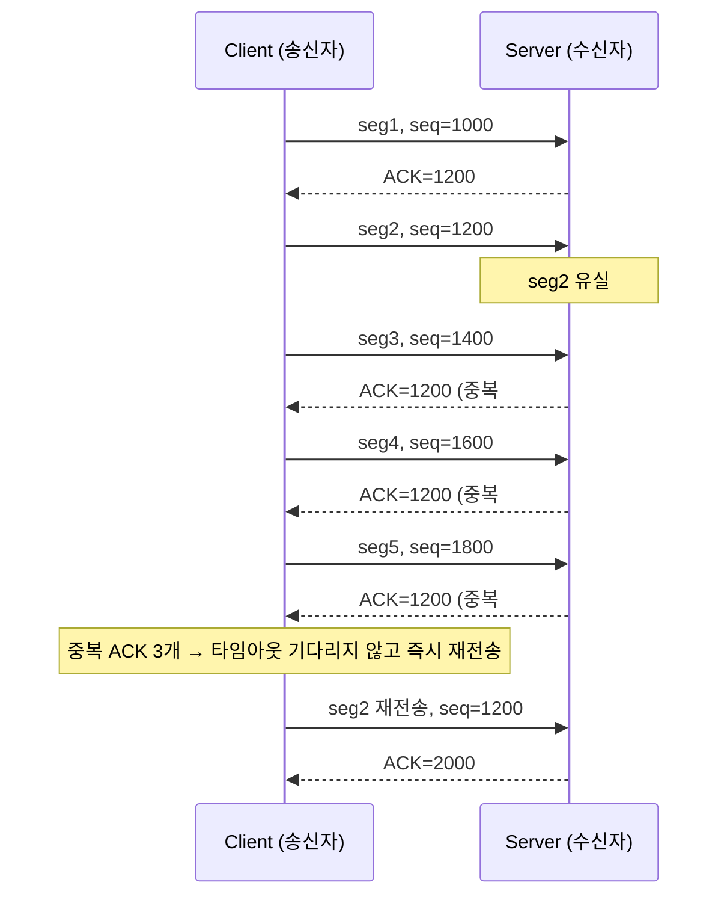

[지난 글]()에서 흐름제어는 "얼마나 보낼지"를 조절한다고 했습니다. 이번 글은 다른 질문입니다: **보낸 데이터가 실제로 도착했는지, TCP는 어떻게 알까요?**

시작하기 전에, 3편에서 미뤄뒀던 질문에 먼저 답하겠습니다 — 시퀀스 넘버는 왜 필요할까요? 보내는 바이트마다 번호를 매겨두면, 수신자는 (1) 도착한 세그먼트들을 원래 순서대로 재조립할 수 있고, (2) 번호가 하나라도 비어 있으면 그걸 보고 유실을 정확히 알아챌 수 있습니다. 이번 글은 바로 이 두 번째 능력 — 시퀀스 넘버로 유실을 알아채고 복구하는 법을 다룹니다.

## ACK는 "누적" 확인이다

TCP의 ACK 번호는 "이 세그먼트를 받았다"가 아니라 **"이 번호 이전까지 순서대로 빠짐없이 받았다"**는 뜻입니다. 이걸 누적 확인(cumulative ACK)이라고 부릅니다. 중간에 하나가 비면, 그 뒤에 아무리 많은 세그먼트가 도착해도 ACK 번호는 그 빈 자리에서 멈춰 있습니다.

<figure class="post-figure">
<svg viewBox="0 0 640 170" role="img" aria-label="1200-1400 구간이 유실되면, 그 뒤의 1400-2000 구간이 모두 도착해도 ACK는 여전히 1200에 머물러 있다." xmlns="http://www.w3.org/2000/svg">
  <line x1="152" y1="38" x2="152" y2="50" stroke="var(--tcp-accent)" stroke-width="2"/>
  <path d="M 146,44 L 152,52 L 158,44" fill="none" stroke="var(--tcp-accent)" stroke-width="2"/>
  <text x="152" y="14" font-size="13" font-weight="700" fill="var(--tcp-accent)" font-family="sans-serif" text-anchor="middle">ACK = 1200</text>
  <text x="152" y="30" font-size="10" fill="var(--tcp-accent)" fill-opacity="0.85" font-family="sans-serif" text-anchor="middle">뒤가 다 도착해도 그대로</text>

  <rect x="40" y="50" width="112" height="50" fill="none" stroke="currentColor" stroke-width="1.5"/>
  <text x="96" y="80" font-size="11" fill="currentColor" font-family="sans-serif" text-anchor="middle">받음</text>

  <rect x="152" y="50" width="112" height="50" fill="none" stroke="var(--tcp-warn)" stroke-width="2" stroke-dasharray="4 3"/>
  <text x="208" y="80" font-size="11" fill="var(--tcp-warn)" font-family="sans-serif" text-anchor="middle">유실</text>

  <rect x="264" y="50" width="112" height="50" fill="none" stroke="currentColor" stroke-width="1.5" stroke-dasharray="4 3" fill-opacity="0.5"/>
  <text x="320" y="74" font-size="10" fill="currentColor" fill-opacity="0.8" font-family="sans-serif" text-anchor="middle">받았지만</text>
  <text x="320" y="88" font-size="10" fill="currentColor" fill-opacity="0.8" font-family="sans-serif" text-anchor="middle">보류 중</text>

  <rect x="376" y="50" width="112" height="50" fill="none" stroke="currentColor" stroke-width="1.5" stroke-dasharray="4 3"/>
  <text x="432" y="74" font-size="10" fill="currentColor" fill-opacity="0.8" font-family="sans-serif" text-anchor="middle">받았지만</text>
  <text x="432" y="88" font-size="10" fill="currentColor" fill-opacity="0.8" font-family="sans-serif" text-anchor="middle">보류 중</text>

  <rect x="488" y="50" width="112" height="50" fill="none" stroke="currentColor" stroke-width="1.5" stroke-dasharray="4 3"/>
  <text x="544" y="74" font-size="10" fill="currentColor" fill-opacity="0.8" font-family="sans-serif" text-anchor="middle">받았지만</text>
  <text x="544" y="88" font-size="10" fill="currentColor" fill-opacity="0.8" font-family="sans-serif" text-anchor="middle">보류 중</text>

  <text x="40" y="128" font-size="10" fill="currentColor" fill-opacity="0.6" font-family="sans-serif" text-anchor="middle">1000</text>
  <text x="152" y="128" font-size="10" fill="currentColor" fill-opacity="0.6" font-family="sans-serif" text-anchor="middle">1200</text>
  <text x="264" y="128" font-size="10" fill="currentColor" fill-opacity="0.6" font-family="sans-serif" text-anchor="middle">1400</text>
  <text x="376" y="128" font-size="10" fill="currentColor" fill-opacity="0.6" font-family="sans-serif" text-anchor="middle">1600</text>
  <text x="488" y="128" font-size="10" fill="currentColor" fill-opacity="0.6" font-family="sans-serif" text-anchor="middle">1800</text>
  <text x="600" y="128" font-size="10" fill="currentColor" fill-opacity="0.6" font-family="sans-serif" text-anchor="middle">2000</text>
</svg>
<figcaption>1200~1400 구간이 유실되면, 그 뒤 구간이 전부 도착해도 ACK 번호는 1200에서 멈춘다. 수신자는 뒤에 온 데이터를 버리지 않고 보류(buffer)하고 있다가, 빈 구간이 채워지면 한 번에 밀어서 애플리케이션에 넘긴다.</figcaption>
</figure>

## 유실을 알아채는 두 가지 방법

TCP가 "어딘가 없어졌다"는 걸 알아채는 방법은 두 가지입니다.

### 1. 타임아웃 (가장 느린 방법)

세그먼트를 보내고 일정 시간(RTO, Retransmission Timeout) 안에 ACK가 안 오면 유실됐다고 판단하고 재전송합니다. RTO를 정확히 얼마로 잡을지는 계산식이 따로 있는데, 그 공식은 커널 구현을 다루는 심화편에서 자세히 봅니다. 지금은 "일정 시간 기다렸다가, 안 오면 다시 보낸다"는 것만 알면 됩니다.

타임아웃 방식의 문제는 이름 그대로 "느리다"는 겁니다. RTO는 네트워크 상황에 안전하게 여유를 두고 잡히기 때문에, 유실이 발생한 순간부터 재전송까지 꽤 긴 시간이 그냥 낭비됩니다.

### 2. 중복 ACK — Fast Retransmit (더 빠른 방법)

seg2가 유실됐어도 seg3, seg4, seg5는 정상적으로 도착할 수 있습니다. 이때 수신자는 각각에 대해 "나 아직 1200 기다려"라는 뜻으로 **똑같은 ACK 번호를 반복해서** 보냅니다. 이게 중복 ACK(duplicate ACK)입니다. 송신자는 이 패턴을 보고 타임아웃을 기다리지 않고 바로 재전송할 수 있습니다.

관례적으로 **중복 ACK가 3개(즉 같은 ACK가 총 4번) 오면** 송신자는 "타임아웃까지 기다릴 필요 없이 확실히 유실됐다"고 판단하고 즉시 재전송합니다. 이게 **fast retransmit**입니다. 마지막 ACK가 2000으로 한 번에 뛴 것도 주목할 만합니다 — seg2가 채워지자, 이미 보류돼 있던 seg3·4·5까지 한꺼번에 확인됩니다. 앞서 본 누적 ACK 그림 그대로입니다.

## 곁다리: 누적 ACK만으로는 아쉬울 때 — SACK

누적 ACK는 "몇 번까지 받았다"만 말해줄 수 있습니다. 그런데 만약 seg2뿐 아니라 seg4도 같이 유실됐다면 어떨까요? 송신자는 ACK=1200만 보고는 seg2가 유실된 건 알아도 seg4까지 같이 유실됐는지는 알 방법이 없습니다 — seg2를 재전송하고 나서야, 다음 라운드에 가서야 "어, seg4도 다시 보내야 하네"를 알게 됩니다.

이 비효율을 보완하는 게 **SACK(Selective Acknowledgment)**입니다. SACK를 지원하면 수신자는 누적 ACK 번호와 별개로 "1400~1600도 이미 받아서 갖고 있어"처럼 듬성듬성 받은 구간까지 옵션 필드에 실어 보낼 수 있습니다. 송신자는 이 정보로 정확히 어느 구간만 다시 보내면 되는지 한 번에 압니다. 앞서 본 "받았지만 보류 중" 그림 기억하시나요 — SACK는 그 보류 중인 구간들을 수신자가 직접 알려주는 셈입니다. 요즘 대부분의 TCP 구현은 handshake 때 SACK 지원 여부를 서로 확인하고 기본으로 켜둡니다.

## 다음 글

지금까지는 "패킷이 유실되면 다시 보낸다"까지만 다뤘습니다. 그런데 애초에 왜 유실이 일어날까요? 대부분은 네트워크 중간 어딘가가 혼잡해서 라우터가 패킷을 버리기 때문입니다. 다음 글에서는 TCP가 이 혼잡을 어떻게 감지하고 대응하는지 — 혼잡제어의 큰 그림을 다룹니다.
