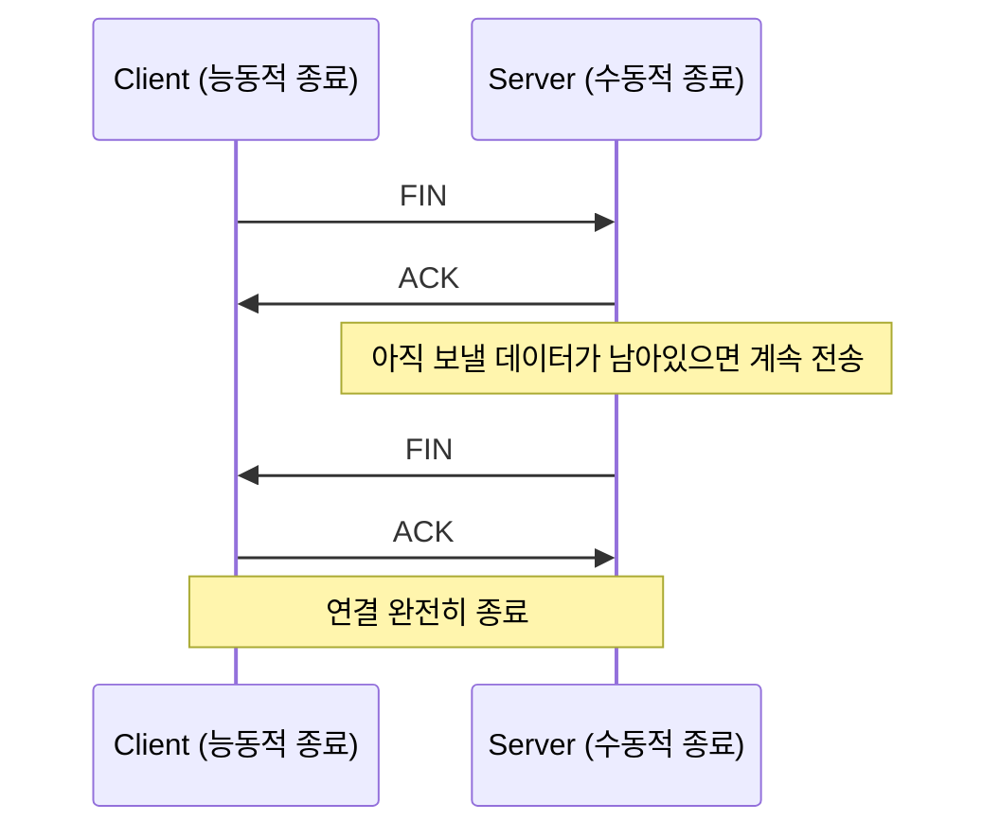
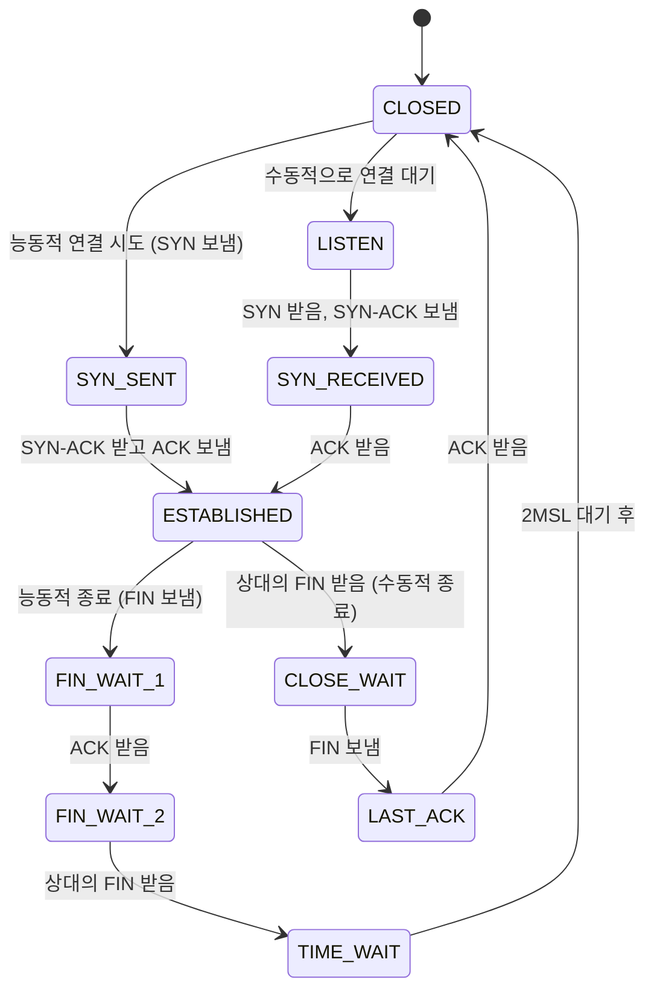

[지난 글]()까지 연결을 맺고, 데이터를 주고받고, 혼잡을 피하는 법을 봤습니다. 기본 단계 마지막인 이번 글은 연결을 어떻게 끝내는지를 다룹니다.

## FIN이 네 번 오가는 이유

연결을 맺을 때는 3번(SYN, SYN-ACK, ACK)이었는데, 끊을 때는 보통 4번입니다.



연결 수립 때는 서버가 "확인(ACK)"과 "나도 시작할게(SYN)"를 한 세그먼트에 같이 실어 보낼 수 있었습니다. 종료할 때는 그게 항상 되지는 않습니다. 클라이언트의 FIN을 받은 서버는 일단 "받았다"는 ACK부터 바로 보내지만, 자기 쪽 FIN은 **아직 보낼 데이터가 남아있으면** 그걸 다 보내고 나서야 보낼 수 있습니다. 그래서 ACK와 FIN이 시간차를 두고 따로 나가는 경우가 많고, 결과적으로 메시지가 4개가 됩니다. (마침 타이밍이 맞아서 서버의 ACK와 FIN이 한 세그먼트에 묶여 나가면 3번으로 끝나기도 합니다.)

## Half-close — 한쪽만 먼저 닫을 수 있다

클라이언트가 FIN을 보냈다고 연결이 바로 끝나는 게 아닙니다. FIN은 "나는 더 이상 보낼 데이터가 없다"는 뜻이지, "더 이상 받지도 않겠다"는 뜻이 아닙니다. 그래서 클라이언트가 FIN을 보낸 뒤에도 서버는 계속 데이터를 보낼 수 있고, 클라이언트는 그걸 받습니다. 이 상태를 **half-close**라고 합니다 — 한쪽 방향은 닫혔지만 반대 방향은 아직 열려 있는 상태입니다.

이것도 앞선 다이어그램의 "Note over S: 아직 보낼 데이터가 남아있으면 계속 전송" 부분이 바로 half-close입니다. 종료를 **누가 먼저 시작하는지**는 정해져 있지 않습니다. 클라이언트든 서버든 먼저 FIN을 보낸 쪽이 "능동적 종료(active close)", 받은 쪽이 "수동적 종료(passive close)"가 됩니다.

## 전체 생애주기를 하나로 묶어보면

지금까지 3편(연결 수립)부터 이 글(연결 종료)까지 나온 상태들을 전부 모으면, TCP 연결의 전체 상태머신이 됩니다.



지금은 이 상태들의 이름과 대략적인 흐름만 눈에 익히면 충분합니다. 이 상태들이 실제 Linux 커널 소스 코드의 어느 부분에 대응하는지는 심화 단계에서 직접 코드를 따라가며 봅니다. `ss -tan`을 실행하면 지금 이 컴퓨터의 TCP 연결들이 이 상태들 중 어디에 있는지 실시간으로 볼 수 있습니다.

## TIME_WAIT — 왜 존재하고, 왜 자주 골칫거리가 되는가

위 상태머신에서 능동적으로 종료한 쪽은 마지막에 바로 CLOSED로 가지 않고 **TIME_WAIT**을 거칩니다. 보통 MSL(Maximum Segment Lifetime, 세그먼트가 네트워크에 살아있을 수 있는 최대 시간)의 2배, 즉 **2MSL** 동안 머뭅니다. 리눅스는 관례적으로 MSL을 30초로 잡아서, TIME_WAIT이 보통 60초 정도 유지됩니다.

이 대기 시간이 있는 이유는 두 가지입니다.

- **마지막 ACK가 유실될 경우를 대비**: 마지막 ACK가 상대방(LAST_ACK 상태)에게 도착하지 못하면, 상대방은 FIN을 다시 보냅니다. 내가 이미 CLOSED로 가버렸다면 이 재전송된 FIN에 응답할 수 없어서 상대방은 영원히 LAST_ACK에 머물게 됩니다. TIME_WAIT 동안은 아직 이 5-tuple을 기억하고 있으므로, 재전송된 FIN에 다시 ACK를 보내줄 수 있습니다.
- **옛 연결의 떠도는 세그먼트가 새 연결과 섞이지 않게**: 같은 5-tuple로 새 연결을 바로 다시 맺으면, 방금 끝난 연결에서 지연되어 떠돌던 세그먼트가 새 연결의 데이터로 착각될 위험이 있습니다. 2MSL이면 네트워크에 남아있을 수 있는 옛 세그먼트가 확실히 다 사라졌다고 볼 수 있는 시간입니다. (1편에서 이야기한 "세그먼트가 옛 연결과 섞이면 안 된다"는 문제가 여기서도 등장합니다.)

### 실무에서 왜 문제가 되는가

TIME_WAIT은 능동적으로 종료한 쪽에 쌓입니다. keep-alive 없이 매 요청마다 연결을 새로 맺는 HTTP 서버처럼, 서버가 먼저 끊는 구조라면 TIME_WAIT은 서버에 쌓입니다. 이때 서버의 로컬 포트는 (2편에서 봤듯이) `:80`처럼 항상 고정이므로 포트가 모자라지는 않지만, 소켓 하나하나가 커널의 연결 테이블 항목을 차지하기 때문에 TIME_WAIT 소켓이 수천~수만 개씩 쌓이면 메모리와 커널 자원을 갉아먹습니다.

```
$ ss -tan | grep TIME-WAIT | wc -l
4213
```

진짜 "포트 고갈"은 반대 역할에서 일어납니다. 어떤 호스트가 매번 새 임시 포트로 밖으로(outbound) 연결을 열고, 그 연결을 자기가 먼저 끊기까지 한다면 — 예를 들어 백엔드로 계속 새 연결을 여는 리버스 프록시, 혹은 짧은 요청을 반복해서 보내는 클라이언트 — 방금 쓴 임시 포트가 TIME_WAIT에 묶여 한동안 재사용되지 못합니다. 임시 포트 범위(2편에서 본 dynamic 구간)는 보통 3만 개 안팎이라, 초당 연결 생성 수가 많으면 이 범위가 실제로 바닥나서 새 연결을 열 포트가 없는 상황이 벌어집니다.

서버를 재시작할 때도 TIME_WAIT 관련 문제가 있습니다. 방금 껐다 켠 서버가 같은 포트에 다시 바인딩하려고 하면, 그 포트로 맺어졌던 연결들이 아직 TIME_WAIT에 남아있어서 `bind: Address already in use` 에러가 날 수 있습니다. 이때 흔히 쓰는 게 `SO_REUSEADDR` 소켓 옵션입니다 — TIME_WAIT 상태인 옛 소켓이 남아있어도 같은 주소·포트에 새로 바인딩할 수 있게 해줍니다. (TIME_WAIT 자체가 없어지는 건 아니고, 새 소켓이 그 포트를 같이 쓸 수 있게 허용하는 것뿐입니다.)

## 기본 단계를 마치며

3편부터 여기까지, TCP 연결의 전체 생애주기 — 맺고(3편), 흐름을 조절하며 데이터를 주고받고(4편), 유실을 복구하고(5편), 혼잡을 피하고(6편), 끊는(7편) 과정을 순서대로 봤습니다. 이 정도가 "TCP를 쓰는 사람"이 알면 충분한 레벨입니다.

## 다음 글

심화 단계로 넘어갑니다. 지금까지 "이렇게 동작한다"고 설명한 내용들을 이제부터는 RFC 원문과 실제 Linux 커널 소스 코드로 하나씩 검증합니다. 첫 글은 RFC 793(1981)과 RFC 9293(2022)을 비교하는 것부터 시작합니다.
