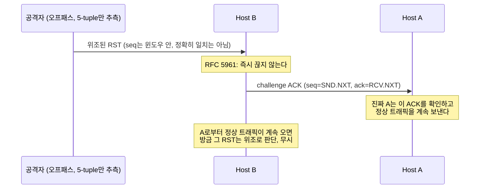

기본 단계에서는 "TCP는 이렇게 동작한다"고 설명하고 넘어간 것들이 많습니다. 심화 단계는 그걸 원문으로 검증하는 구간입니다.

첫 글은 스펙 자체부터 봅니다 — TCP의 원본 명세인 **RFC 793**(1981)과, 그걸 대체한 최신 명세 **RFC 9293**(2022) 사이에는 41년의 간격이 있습니다. 그동안 뭐가 왜 바뀌었을까요.

## RFC 9293은 혼자가 아니다

RFC 9293은 RFC 793 하나만 대체한 게 아닙니다. 원문에 이렇게 나와 있습니다.

> Obsoletes: 793, 879, 2873, 6093, 6429, 6528, 6691
> Updates: 1011, 1122, 5961

41년 동안 TCP는 RFC 793 본문을 그대로 두고, 여러 개의 별도 RFC로 조각조각 보완돼 왔습니다. RFC 9293은 이 흩어진 조각들을 다시 하나의 문서로 합친 겁니다.

이 중 이 글에서는 실제로 기본편 내용과 맞닿아 있는 두 가지 — ISN 생성(RFC 6528)과 스푸핑 방어(RFC 5961) — 를 원문으로 뜯어봅니다.

## 사례 1: ISN 생성 방식 — 3편에서 예고했던 그 이야기

3편에서 "ISN을 예측 불가능하게 무작위로 고른다"고 했습니다. 원문을 보면 이게 처음부터 그랬던 게 아니라는 걸 알 수 있습니다.

**RFC 793 (1981), Section 3.3**:

> "an initial sequence number (ISN) generator is employed which selects a new 32 bit ISN. The generator is bound to a (possibly fictitious) 32 bit clock whose low order bit is incremented roughly every 4 microseconds."

원래는 그냥 4마이크로초마다 증가하는 시계였습니다. 예측 불가능하게 만들려는 의도가 아니라, 그냥 "매번 다른 값이 나오게" 하려는 실용적인 장치였습니다. 이 방식대로면 ISN은 시계를 보고 그대로 계산할 수 있습니다.

**RFC 9293 (2022), Section 3.4.1**:

> "ISN = M + F(localip, localport, remoteip, remoteport, secretkey)"

M은 여전히 시간 기반 값이지만, 여기에 **F()라는 의사난수함수**가 더해졌습니다. RFC 9293은 이 F()에 대해 명시적으로 요구사항을 답니다: "F() MUST NOT be computable from the outside" — 즉 공격자가 다음 ISN을 계산해낼 수 있으면 안 됩니다.

이 요구사항은 원래 RFC 6528(2012)이 별도로 추가했던 걸 RFC 9293이 흡수한 겁니다.

3편에서 "ISN을 예측할 수 있으면 세션 하이재킹이 가능하다"고 설명했던 게, 정확히 이 변화의 이유입니다. 1981년의 TCP는 이 위협 자체를 고려하지 않았고, 그로부터 31년 뒤에야 스펙에 명시적으로 박혔습니다.

## 사례 2: MSL — 7편에서 나온 "2분"이 진짜 스펙값이었다

7편에서 "리눅스는 관례적으로 MSL을 30초로 잡는다"고 했습니다. "관례적으로"라고 쓴 이유가 있습니다. RFC 793 원문을 보면:

> "For this specification the MSL is taken to be 2 minutes. This is an engineering choice, and may be changed if experience indicates it is desirable to do so."

스펙이 정의하는 값은 **2분**입니다. 그런데 실제 구현체(Linux 포함)는 이 값을 그대로 쓰지 않고 30초로 줄여서 씁니다.

스펙 스스로 이 값을 "engineering choice"(공학적으로 정한 값)이라 부르고, 경험에 따라 바뀔 수 있다고 못 박아뒀기 때문에 구현체들이 실용적인 값으로 조정해도 스펙 위반이 아닙니다. 이게 바로 심화 단계에서 하려는 것의 좋은 예시입니다 — 기본편에서 "관례적으로 30초"라고 뭉뚱그렸던 게, 원문을 보니 "스펙은 2분이라고 하지만, 스펙 스스로도 그건 바뀔 수 있는 값이라고 인정한다"는 훨씬 구체적인 그림으로 바뀝니다.

## 사례 3: RFC 5961 — RST 하나로 연결을 끊을 수 있었다

3편에서 RST를 잠깐 언급했습니다("클라이언트가 요청하지 않은 SYN-ACK에는... 오히려 RST를 보내"). RFC 793 원문에서 RST가 유효한지 검증하는 기준은 이렇습니다.

> "A reset is valid if its sequence number is in the window."

즉 시퀀스 넘버가 현재 수신 윈도우 범위 안에만 있으면 RST가 그대로 받아들여집니다. 문제는 공격자가 5-tuple(2편에서 배운 그 5-tuple)만 알아내면, 정확한 시퀀스 넘버를 몰라도 그 넓은 윈도우 범위 "안" 어딘가에만 걸치면 성공한다는 겁니다.

RFC 5961은 이 확률을 직접 계산합니다 — 무작위로 시도할 때 성공까지 평균적으로 필요한 시도 횟수는 **2³¹ / 윈도우 크기**입니다(2³²가 아니라 그 절반인 이유는 시퀀스 넘버 비교가 "절반은 앞, 절반은 뒤"로 취급되기 때문 — 10편에서 다룰 PAWS의 비교 규칙과 같은 원리입니다).

윈도우가 32KB(32,768바이트)라면 2³¹/32,768 = 65,536번 — 평균 6만 5천 번 정도면 실제 연결도 아니면서 시퀀스 넘버 범위만 노려서 남의 연결을 끊을 수 있었다는 뜻입니다.

RFC 5961(2010)은 이 검증을 훨씬 엄격하게 바꿨습니다.

> "If the RST bit is set and the sequence number exactly matches the next expected sequence number (RCV.NXT), then TCP MUST reset the connection."

**RCV.NXT**(수신자가 다음에 받기를 기대하는 시퀀스 넘버 — 5편에서 본 누적 ACK 값이 바로 이겁니다)와 시퀀스 넘버가 정확히 일치해야만 RST가 즉시 받아들여집니다.

그럼 윈도우 안이지만 정확히 일치하지는 않는 애매한 경우는 어떻게 할까요? 바로 거부하지 않고, 대신 **challenge ACK**를 보냅니다.

정상적인 상대방(Host A)이라면 이 challenge ACK를 받아도 자기 연결 상태와 비교해서 "어, 나는 이런 걸 보낸 적 없는데"라며 그냥 무시하고 원래 하던 통신을 계속합니다. 반면 공격자는 애초에 이 challenge ACK를 볼 수 있는 위치(오프패스)에 있지 않으므로 응답할 수 없습니다.

결과적으로 공격 난이도가 "윈도우 크기만큼의 시도"에서 "시퀀스 넘버 공간 전체의 절반(2^31)"으로 뛰어오릅니다 — 사실상 무작위로 맞히는 수준입니다.

SYN 공격도 비슷하게 바뀌었습니다. 이건 "새 연결 요청"이 아니라 **이미 ESTABLISHED인 연결에 뜬금없이 SYN이 도착한 경우**입니다.

상대방이 크래시 후 재시작하면 이 연결을 맺었다는 걸 까맣게 잊어버리고, 다시 뭔가 보내려 할 때 SYN부터 새로 시작합니다. 그래서 원래 RFC 793은 "ESTABLISHED 상태에서 SYN이 온다 = 상대가 재시작해서 이 연결을 잊어버렸다"고 해석해 즉시 RST로 응답해 정리했는데, 공격자가 5-tuple만 알면 이 SYN을 위조해서 멀쩡히 살아있는 연결을 끊어버릴 수 있었습니다.

RFC 5961은 여기도 즉시 RST 대신 challenge ACK로 바꿨습니다. B(수신자)가 challenge ACK를 A(진짜 상대방)에게 보내면 — A가 정말로 재시작했던 거라면 A는 이 연결 자체를 모르니 모르는 ACK를 받고 자기가 RST로 응답할 것이고, B는 그 RST를 받고 나서야 연결을 정리합니다.

반대로 A가 재시작한 적 없고 공격자가 SYN을 위조한 거라면, A는 이 연결을 여전히 정상적으로 알고 있으므로 B의 challenge ACK를 그냥 이상한 중복 ACK 정도로 취급해 무시합니다 — RST가 안 오니 연결은 안전하게 유지됩니다.

## 사례 4: Urgent pointer — 사소하지만 실존했던 모호함

1편에서 다루지 않고 넘어갔던 필드가 하나 있습니다. RFC 793은 urgent pointer가 정확히 어느 바이트를 가리키는지에 대해 구현체마다 다르게 해석할 여지를 남겨뒀습니다. RFC 9293은 이렇게 명확히 합니다.

> "The urgent pointer points to the sequence number of the octet following the urgent data."

"urgent data 바로 다음 바이트"라고 못박은 겁니다. 이건 보안 이슈라기보다는, 서로 다른 OS의 TCP 구현체들이 미묘하게 다르게 동작하던 걸 RFC 6093(2011)이 정리하고 RFC 9293이 흡수한 사례입니다.

지금은 urgent pointer 자체를 쓰는 애플리케이션이 거의 없어서 실무 영향은 크지 않지만, "스펙이 모호하면 구현체마다 갈린다"는 걸 보여주는 좋은 예시입니다.

## 지금 구현체들은 최신 스펙을 따르는가

리눅스를 포함한 대부분의 현대 TCP 구현체는 RFC 5961의 challenge ACK 방식과 RFC 6528의 ISN 요구사항을 이미 구현하고 있습니다 — 정확히 어떤 커널 코드가 이걸 처리하는지는 11편(Linux TCP 상태머신)에서 SYN cookie와 함께 직접 소스를 따라가며 확인합니다.

## 다음 글

지금까지는 스펙의 "본문"에서 바뀐 지점들을 봤습니다. 다음 글에서는 시선을 좁혀서 TCP 헤더 20바이트를 비트 단위로 완전히 분해합니다.

방금 나온 ISN도, 그리고 5편·6편에서 예고했던 SACK·ECN도 전부 이 헤더의 특정 비트 자리에 대응합니다.
