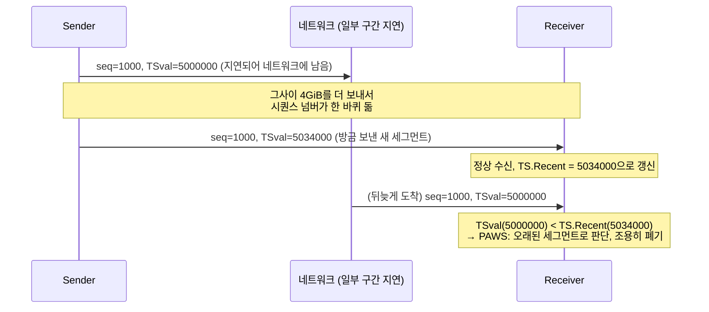

[지난 글]()에서 Sequence Number가 32비트라는 걸 헤더 다이어그램으로 확인했습니다. 32비트는 유한합니다 — 그래서 언젠가는 최댓값을 넘고 다시 0으로 돌아갑니다. 이번 글은 그 순간 무슨 일이 일어나는지를 다룹니다.

## Wraparound은 생각보다 자주 일어난다

시퀀스 넘버는 32비트라서 **2^32바이트, 즉 4GiB**를 보내고 나면 다시 0으로 돌아갑니다. "4GiB나 보내려면 한참 걸리겠지"라고 생각하기 쉬운데, 실제로 계산해보면 그렇지 않습니다.

| 링크 속도 | 4GiB를 다 보내는 데 걸리는 시간 |
|---|---|
| 10 Mbps | 약 57분 |
| 100 Mbps | 약 5.7분 |
| 1 Gbps | 약 34초 |
| 10 Gbps | 약 3.4초 |

7·8편에서 본 MSL(스펙상 2분, 리눅스 실제로는 30초)과 비교해보면 심각성이 드러납니다. **1 Gbps 회선이면 시퀀스 넘버가 MSL보다도 짧은 시간 안에 한 바퀴 돕니다.** 10 Gbps라면 MSL이 지나기 전에 아홉 바퀴도 넘게 돌 수 있습니다. RFC 7323은 이 문제를 이렇게 정의합니다.

> "At a high enough transfer rate of large volumes of data (at least 4 GiB in the same session), the 32-bit sequence space may be 'wrapped'."

## 왜 이게 문제가 되는가

5편에서 재전송을 다룰 때, "지연되거나 중복된 세그먼트"를 계속 전제로 깔았습니다. 시퀀스 넘버가 한 바퀴만 돈다면 상관없습니다 — 문제는 **같은 연결 안에서 시퀀스 넘버가 여러 번 재사용된다는 것**입니다. 오래전에 보냈다가 네트워크 어딘가에서 지연된 세그먼트가, 그사이 연결이 계속 데이터를 보내서 시퀀스 넘버가 한 바퀴(혹은 여러 바퀴) 돈 뒤에야 뒤늦게 도착하면 어떻게 될까요? 그 세그먼트의 시퀀스 넘버가 **지금 막 보낸 새 세그먼트와 우연히 같은 값**일 수 있습니다.

<figure class="post-figure">
<svg viewBox="0 0 640 260" role="img" aria-label="시퀀스 넘버는 0부터 증가하다가 2^32에 도달하면 다시 0으로 돌아가는 톱니 모양을 그린다. 서로 다른 시점(첫 바퀴, 세 번째 바퀴)에 같은 시퀀스 넘버 값이 나타날 수 있다." xmlns="http://www.w3.org/2000/svg">
  <line x1="40" y1="30" x2="40" y2="220" stroke="currentColor" stroke-width="1.5"/>
  <line x1="40" y1="220" x2="600" y2="220" stroke="currentColor" stroke-width="1.5"/>
  <text x="20" y="125" font-size="12" fill="currentColor" font-family="sans-serif" text-anchor="middle" transform="rotate(-90 20 125)">시퀀스 넘버</text>
  <text x="580" y="240" font-size="12" fill="currentColor" fill-opacity="0.7" font-family="sans-serif" text-anchor="middle">시간</text>

  <line x1="40" y1="220" x2="220" y2="40" stroke="currentColor" stroke-width="2"/>
  <line x1="220" y1="220" x2="400" y2="40" stroke="currentColor" stroke-width="2"/>
  <line x1="400" y1="220" x2="580" y2="40" stroke="currentColor" stroke-width="2"/>
  <line x1="220" y1="40" x2="220" y2="220" stroke="currentColor" stroke-width="1" stroke-dasharray="2 3" fill-opacity="0.5"/>
  <line x1="400" y1="40" x2="400" y2="220" stroke="currentColor" stroke-width="1" stroke-dasharray="2 3" fill-opacity="0.5"/>
  <text x="220" y="234" font-size="9" fill="currentColor" fill-opacity="0.6" font-family="sans-serif" text-anchor="middle">1바퀴</text>
  <text x="400" y="234" font-size="9" fill="currentColor" fill-opacity="0.6" font-family="sans-serif" text-anchor="middle">2바퀴</text>

  <line x1="148" y1="112" x2="508" y2="112" stroke="var(--tcp-warn)" stroke-width="1.5" stroke-dasharray="4 3"/>
  <circle cx="148" cy="112" r="4" fill="var(--tcp-warn)"/>
  <circle cx="508" cy="112" r="4" fill="var(--tcp-warn)"/>
  <text x="148" y="98" font-size="10" font-weight="600" fill="var(--tcp-warn)" font-family="sans-serif" text-anchor="middle">오래된 세그먼트</text>
  <text x="148" y="150" font-size="9" fill="var(--tcp-warn)" fill-opacity="0.85" font-family="sans-serif" text-anchor="middle">(지연 중, 아직 못 도착)</text>
  <text x="508" y="98" font-size="10" font-weight="600" fill="var(--tcp-warn)" font-family="sans-serif" text-anchor="middle">방금 보낸 세그먼트</text>
  <text x="320" y="105" font-size="10" fill="var(--tcp-warn)" font-family="sans-serif" text-anchor="middle">시퀀스 넘버 값이 똑같다!</text>
</svg>
<figcaption>두 세그먼트는 실제 전송 시각이 한참 다르지만, 시퀀스 넘버만 보면 구별할 수 없다 — 시퀀스 넘버 비교만으로는 어느 쪽이 최신인지 알 방법이 없다.</figcaption>
</figure>

수신자가 시퀀스 넘버만 보고 판단한다면, 뒤늦게 도착한 옛날 세그먼트를 "지금 막 도착해야 할 새 데이터"로 착각해서 받아들일 수 있습니다. 5편에서 배운 재전송·중복 감지 메커니즘은 전부 "시퀀스 넘버를 비교해서" 판단했는데, 그 전제 자체가 흔들리는 겁니다.

## PAWS — 시퀀스 넘버 말고 다른 걸 하나 더 보자

RFC 7323(RFC 1323을 개정한 버전)의 **PAWS(Protection Against Wrapped Sequence numbers)**는 해법이 의외로 단순합니다. 시퀀스 넘버 하나만 믿지 말고, **9편에서 이미 언급했던 Timestamps 옵션**을 같이 보자는 겁니다.

Timestamps 옵션은 세그먼트마다 TSval(보내는 쪽의 현재 타임스탬프)을 싣습니다. 수신자는 마지막으로 정상 수신한 세그먼트의 TSval을 `TS.Recent`라는 값으로 기억해둡니다. 새 세그먼트가 도착하면 이렇게 판단합니다(RFC 7323 Section 5.3, 규칙 R1).

> "If there is a Timestamps option in the arriving segment, SEG.TSval < TS.Recent, TS.Recent is valid... then treat the arriving segment as not acceptable."

즉 **들어온 세그먼트의 TSval이 기억해둔 TS.Recent보다 작으면, 시퀀스 넘버가 뭐라고 하든 상관없이 그냥 오래된 걸로 판단하고 버립니다.** 타임스탬프는 시간이 지나면 계속 증가하기만 하는 값이라(시퀀스 넘버처럼 데이터 양에 따라 요동치지 않음), 아무리 시퀀스 넘버가 우연히 같아져도 "언제 보낸 세그먼트인가"라는 기준으로는 절대 헷갈리지 않습니다.

시퀀스 넘버는 두 세그먼트 다 1000으로 똑같지만, 타임스탬프 덕분에 수신자는 뒤늦게 온 쪽이 예전 것이라는 걸 정확히 압니다. 참고로 이 비교도 32비트 값이라 자체적으로 wraparound 문제가 있을 수 있는데, RFC 7323은 여기에 부호 있는 비교(`0 < (t - s) < 2^31`)를 써서 해결합니다 — 이 값은 보통 밀리초 단위로 증가하므로, 시퀀스 넘버보다 훨씬 느리게 한 바퀴 돌아서 실용적으로는 문제가 되지 않습니다.

## 정리

- 시퀀스 넘버는 32비트라서 4GiB마다 한 바퀴 돈다.
- 빠른 네트워크일수록 이 한 바퀴가 MSL보다도 짧게 걸릴 수 있어서, "옛날 세그먼트가 아직 살아있는 상태에서 시퀀스 넘버가 재사용"되는 상황이 실제로 일어난다.
- PAWS는 시퀀스 넘버 대신(정확히는 추가로) 항상 증가하는 타임스탬프를 비교해서, 이런 오래된 중복 세그먼트를 걸러낸다.

## 다음 글

스펙 검증은 여기서 일단락됩니다. 다음 글부터는 지금까지 "이렇게 정의돼 있다"고 본 것들이 실제로 Linux 커널 코드 어디서, 어떻게 돌아가는지 소스를 직접 따라갑니다.
