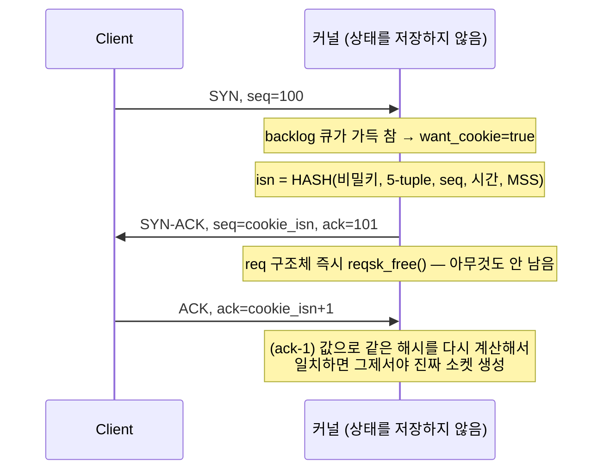

[8~10편]()에서 스펙 원문을 검증했습니다. 이제부터는 그 스펙이 실제로 코드로 어떻게 구현됐는지 봅니다. 기준은 **Linux 커널 v6.6**, 파일은 `net/ipv4/tcp_input.c`와 `net/ipv4/syncookies.c`입니다. (커널 버전마다 세부 구현이 조금씩 다를 수 있습니다 — 아래 인용은 전부 v6.6 기준입니다.)

## 상태 이름부터 확인

7편에서 그린 상태 다이어그램의 이름들이 실제 커널에도 그대로 있는지부터 봅니다. `include/net/tcp_states.h`:

```c
enum {
	TCP_ESTABLISHED = 1,
	TCP_SYN_SENT,
	TCP_SYN_RECV,
	TCP_FIN_WAIT1,
	TCP_FIN_WAIT2,
	TCP_TIME_WAIT,
	TCP_CLOSE,
	TCP_CLOSE_WAIT,
	TCP_LAST_ACK,
	TCP_LISTEN,
	TCP_CLOSING,	/* Now a valid state */
	TCP_NEW_SYN_RECV,

	TCP_MAX_STATES	/* Leave at the end! */
};
```

`TCP_CLOSING`이 정말로 있습니다 — 게다가 주석까지 `/* Now a valid state */`("이제는 유효한 상태")라고 달려 있는 게 흥미롭습니다. 7편에서 다룬 동시 종료 케이스가 한때는 이 상태머신에서 이등 시민이었다가 정식으로 편입됐다는 뉘앙스입니다. 덤으로 `TCP_NEW_SYN_RECV`라는, 기본편에서 못 본 상태도 하나 있습니다 — 이건 이번 글 뒤쪽 SYN cookie 섹션에서 다시 나옵니다.

## tcp_rcv_state_process — 상태 전이의 심장부

세그먼트가 도착할 때마다 호출되는 함수가 `tcp_rcv_state_process()`입니다(`tcp_input.c:6490`). 구조를 보면 첫 번째 `switch (sk->sk_state)`에서 `TCP_LISTEN`, `TCP_SYN_SENT`처럼 이른 단계를 먼저 처리하고, 그 아래 두 번째 `switch`에서 `TCP_SYN_RECV`, `TCP_FIN_WAIT1`, `TCP_CLOSING`, `TCP_LAST_ACK`를 처리합니다. 3편의 handshake 마지막 단계부터 봅니다.

```c
case TCP_SYN_RECV:
	tp->delivered++; /* SYN-ACK delivery isn't tracked in tcp_ack */
	...
	smp_mb();
	tcp_set_state(sk, TCP_ESTABLISHED);
	sk->sk_state_change(sk);
	...
```

3편에서 "세 번째 ACK가 도착해야 서버가 연결을 확신한다"고 했던 바로 그 순간이, 여기서 `tcp_set_state(sk, TCP_ESTABLISHED)` 한 줄로 나타납니다.

7편에서 그린 `FIN_WAIT_1 → FIN_WAIT_2`도 있습니다.

```c
case TCP_FIN_WAIT1: {
	...
	if (tp->snd_una != tp->write_seq)
		break;

	tcp_set_state(sk, TCP_FIN_WAIT2);
	...
```

`tp->snd_una != tp->write_seq`는 "내가 보낸 마지막 바이트(FIN 포함)까지 아직 ACK 못 받았다"는 뜻입니다. 이 조건이 참이면 `break`로 그냥 FIN_WAIT_1에 머물고, 상대의 ACK가 와서 이 조건이 거짓이 되어야 비로소 FIN_WAIT_2로 넘어갑니다 — 정확히 7편 다이어그램의 "ACK 받음" 화살표입니다.

## CLOSING — 7편에서 그린 그 화살표가 주석까지 똑같다

7편에서 "양쪽이 동시에 FIN을 보내면 FIN_WAIT_1에서 CLOSING으로 전환된다"고 곁다리로 설명했습니다. 이 전이를 처리하는 함수는 `tcp_fin()`인데, 함수 시작 부분 주석이 이렇습니다.

```c
/*
 * 	Process the FIN bit. This now behaves as it is supposed to work
 *	and the FIN takes effect when it is validly part of sequence
 *	space. Not before when we get holes.
 *
 *	If we are ESTABLISHED, a received fin moves us to CLOSE-WAIT
 *	(and thence onto LAST-ACK and finally, CLOSE, we never enter
 *	TIME-WAIT)
 *
 *	If we are in FINWAIT-1, a received FIN indicates simultaneous
 *	close and we go into CLOSING (and later onto TIME-WAIT)
 *
 *	If we are in FINWAIT-2, a received FIN moves us to TIME-WAIT.
 */
```

그리고 실제 코드:

```c
case TCP_FIN_WAIT1:
	/* This case occurs when a simultaneous close
	 * happens, we must ack the received FIN and
	 * enter the CLOSING state.
	 */
	tcp_send_ack(sk);
	tcp_set_state(sk, TCP_CLOSING);
	break;
```

"a received FIN indicates simultaneous close" — 7편에서 썼던 "양쪽이 동시에 FIN을 보내면"이라는 표현을 거의 그대로 가져온 것 같은 문장이 커널 주석에 이미 있었습니다. 같은 함수에서 ESTABLISHED와 FIN_WAIT_2 케이스도 확인됩니다.

```c
case TCP_SYN_RECV:
case TCP_ESTABLISHED:
	/* Move to CLOSE_WAIT */
	tcp_set_state(sk, TCP_CLOSE_WAIT);
	...
case TCP_FIN_WAIT2:
	/* Received a FIN -- send ACK and enter TIME_WAIT. */
	tcp_send_ack(sk);
	tcp_time_wait(sk, TCP_TIME_WAIT, 0);
```

7편 상태 다이어그램의 화살표 6개(`ESTABLISHED→CLOSE_WAIT`, `ESTABLISHED→FIN_WAIT_1`, `FIN_WAIT_1→FIN_WAIT_2`, `FIN_WAIT_1→CLOSING`, `FIN_WAIT_2→TIME_WAIT`, `CLOSING→TIME_WAIT`) 전부가 이 두 함수 안의 `switch`문 case 하나씩에 정확히 대응합니다. 그림이 아니라 실제로 이렇게 동작합니다.

## SYN cookie — 3편에서 미뤄뒀던 이야기

3편에서 "backlog 큐가 가득 차면 정상 사용자가 연결을 못 맺는다"고 SYN flood를 설명하면서, 방어 기법은 심화편으로 미뤘습니다. 이제 그 코드를 봅니다.

큐가 가득 찼는지는 `tcp_conn_request()`(`tcp_input.c:6959`)에서 확인합니다.

```c
if ((syncookies == 2 || inet_csk_reqsk_queue_is_full(sk)) && !isn) {
	want_cookie = tcp_syn_flood_action(sk, rsk_ops->slab_name);
	if (!want_cookie)
		goto drop;
}
```

`inet_csk_reqsk_queue_is_full()`이 바로 3편 그림에서 그린 그 backlog 큐입니다. 큐가 꽉 찼고 `syncookies` 설정이 켜져 있으면 `want_cookie = true`가 되고, 코드는 이후로 완전히 다른 길을 탑니다.

```c
if (want_cookie) {
	isn = cookie_init_sequence(af_ops, sk, skb, &req->mss);
	...
}
...
af_ops->send_synack(sk, dst, &fl, req, &foc,
		    !want_cookie ? TCP_SYNACK_NORMAL :
				   TCP_SYNACK_COOKIE,
		    skb);
if (want_cookie) {
	reqsk_free(req);
	return 0;
}
```

핵심은 마지막 세 줄입니다. **SYN-ACK를 보내자마자 `req` 구조체를 즉시 `reqsk_free()`로 지워버립니다.** 큐에 넣지도 않고, 타이머도 걸지 않습니다 — 이 연결 시도에 대해 커널은 정말로 **아무것도 기억하지 않습니다**. 3편에서 본 backlog 큐 자체를 아예 쓰지 않는 겁니다.

그럼 나중에 ACK가 왔을 때 이게 진짜 연결인지 어떻게 알까요? 답은 `isn = cookie_init_sequence(...)`에 있습니다. 이 ISN이 아무 값이나 무작위로 고른 게 아니라, `secure_tcp_syn_cookie()`(`syncookies.c`)에서 이렇게 계산됩니다.

```c
/*
 * Compute the secure sequence number.
 * The output should be:
 *   HASH(sec1,saddr,sport,daddr,dport,sec1) + sseq + (count * 2^24)
 *      + (HASH(sec2,saddr,sport,daddr,dport,count,sec2) % 2^24).
 * Where sseq is their sequence number and count increases every
 * minute by 1.
 * As an extra hack, we add a small "data" value that encodes the
 * MSS into the second hash value.
 */
```

ISN 자체가 **5-tuple(2편에서 배운 그 5-tuple) + 클라이언트의 시퀀스 넘버 + 시간(분 단위 카운터) + MSS 정보**를 커널만 아는 비밀키로 해시한 값입니다. 상태를 어딘가에 저장하는 대신, 상태를 ISN이라는 32비트 안에 압축해서 상대방에게 통째로 돌려보내는 셈입니다. 나중에 ACK가 돌아오면, 그 ACK 번호(-1)를 가지고 같은 해시를 다시 계산해서 일치하는지만 확인하면 됩니다 — 대조할 저장된 상태가 필요 없습니다.



이게 바로 `TCP_NEW_SYN_RECV`가 필요한 이유이기도 합니다 — 앞서 본 상태 enum에서, 일반적인 `TCP_SYN_RECV`(큐에 저장된 request socket)와 별개로 이 이름이 있는 건, 커널 내부적으로 "아직 완전한 소켓은 아니지만 요청은 받은" 중간 단계를 구분해서 관리하기 때문입니다. cookie를 쓰든 안 쓰든 이 경량 구조체 자체는 만들어지지만, cookie 모드에서는 SYN-ACK를 보내자마자 그마저 버려진다는 게 차이입니다.

## 확인해보기

```
$ ss -tan
State       Recv-Q Send-Q Local Address:Port   Peer Address:Port
ESTAB       0      0      192.168.0.5:22       203.0.113.50:51000
SYN-RECV    0      0      192.168.0.5:443      198.51.100.7:52010
FIN-WAIT-1  0      0      192.168.0.5:443      192.0.2.9:53020
```

`ss`가 보여주는 이 문자열들이 전부 방금 본 `tcp_states.h`의 enum 값을 사람이 읽을 수 있게 바꾼 것뿐입니다. `SYN-RECV`가 보인다면 그 소켓은 지금 이 순간 `tcp_rcv_state_process()`의 두 번째 `switch`에서 ACK 하나를 기다리고 있는 겁니다.

## 다음 글

상태머신은 끝냈으니, 다음 글에서는 실제로 데이터가 오가는 경로 — 소켓 버퍼와 재전송 큐, 그리고 5편에서 "일정 시간 기다렸다가 재전송한다"고 뭉뚱그렸던 RTO가 정확히 어떤 공식과 코드로 계산되는지를 봅니다.
