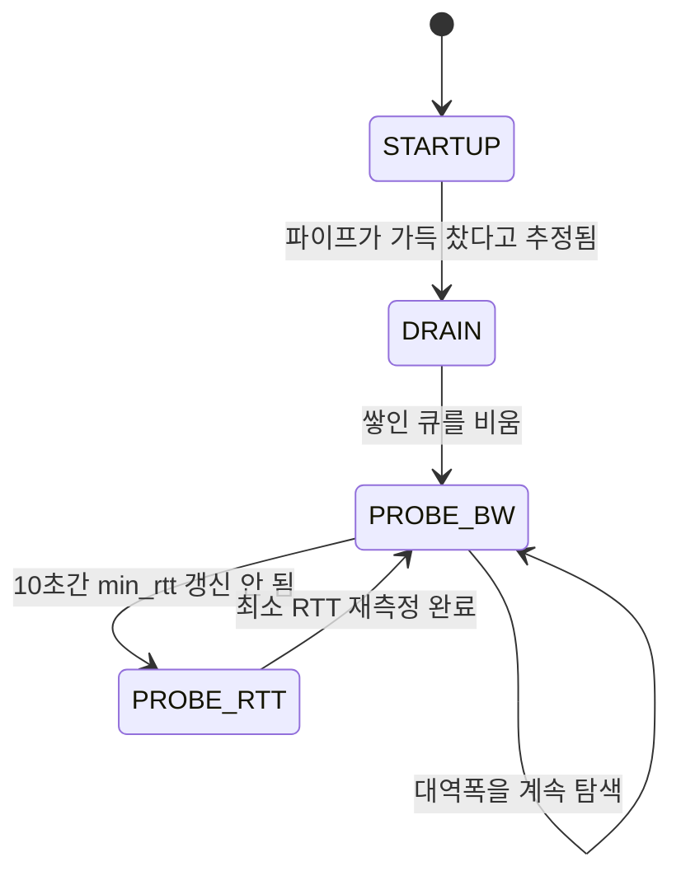

[지난 글]()에서 재전송을 봤으니, 이번엔 6편에서 예고했던 걸 마무리합니다 — Reno, Cubic, BBR이 실제 커널 코드(v6.6, `net/ipv4/tcp_cong.c`·`tcp_cubic.c`·`tcp_bbr.c`) 레벨에서 정확히 뭐가 다른지 봅니다. 미리 말해두면, 6편에서 그린 톱니 그래프는 셋 중 하나(Reno)의 그림일 뿐입니다.

## Reno — 6편에서 그린 그 톱니그래프

리눅스 커널에서 "reno"는 별도 모듈이 아니라 `tcp_cong.c`에 내장된 기본 폴백입니다. 핵심 두 함수:

```c
/* Slow start threshold is half the congestion window (min 2) */
__bpf_kfunc u32 tcp_reno_ssthresh(struct sock *sk)
{
	const struct tcp_sock *tp = tcp_sk(sk);

	return max(tcp_snd_cwnd(tp) >> 1U, 2U);
}
```

`>> 1U`는 오른쪽으로 1비트 시프트, 즉 정확히 **절반**입니다. 6편에서 "유실이 발생하면 cwnd를 절반으로 줄인다"고 한 게 그대로입니다. 증가 쪽도 봅니다.

```c
__bpf_kfunc void tcp_reno_cong_avoid(struct sock *sk, u32 ack, u32 acked)
{
	struct tcp_sock *tp = tcp_sk(sk);

	if (!tcp_is_cwnd_limited(sk))
		return;

	if (tcp_in_slow_start(tp)) {
		acked = tcp_slow_start(tp, acked);
		if (!acked)
			return;
	}
	/* In dangerous area, increase slowly. */
	tcp_cong_avoid_ai(tp, tcp_snd_cwnd(tp), acked);
}
```

slow start 중이면 지수적으로, 아니면 `tcp_cong_avoid_ai`(additive increase)로 **ACK 하나 받을 때마다** 조금씩 늘립니다. 6편의 다이어그램 그대로입니다 — 그도 그럴 것이, 그 다이어그램 자체가 Reno를 기준으로 그린 것이었습니다.

## Cubic — 기본값인데 "절반"이 아니다

리눅스 기본 알고리즘은 Reno가 아니라 **Cubic**입니다. `tcp_cubic.c`의 ssthresh부터 봅니다.

```c
static int beta __read_mostly = 717;	/* = 717/1024 (BICTCP_BETA_SCALE) */
...
__bpf_kfunc static u32 cubictcp_recalc_ssthresh(struct sock *sk)
{
	...
	return max((tcp_snd_cwnd(tp) * beta) / BICTCP_BETA_SCALE, 2U);
}
```

`717/1024 ≈ 0.7`. **손실이 나도 cwnd를 절반이 아니라 약 70%로만 줄입니다.** 6편에서 "유실 시 cwnd를 절반으로 줄인다"고 배운 게, 사실은 Reno에 한정된 얘기였던 겁니다 — 정작 여러분이 지금 이 글을 받는 서버도 십중팔구 Cubic을 쓰고 있는데, 거긴 70%입니다.

늘어나는 방식은 더 크게 다릅니다. Reno는 ACK 하나당 조금씩 늘었는데, Cubic은 **시간**을 기준으로 늘어납니다.

```c
t = (s32)(tcp_jiffies32 - ca->epoch_start);
...
/* c/rtt * (t-K)^3 */
delta = (cube_rtt_scale * offs * offs * offs) >> (10+3*BICTCP_HZ);
if (t < ca->bic_K)                            /* below origin*/
	bic_target = ca->bic_origin_point - delta;
else                                          /* above origin*/
	bic_target = ca->bic_origin_point + delta;
```

`t`는 "마지막 유실(epoch 시작) 이후 얼마나 시간이 지났는가"이고, `bic_target`은 그 시간의 **3차함수**(세제곱)로 계산됩니다. 이름의 "CUBIC"이 여기서 나온 겁니다. ACK 개수가 아니라 시계를 봅니다.

왜 이렇게 설계했을까요? Reno처럼 ACK 하나당 늘리는 방식은, RTT가 짧은 연결이 같은 시간에 ACK를 더 많이 받아서 불공평하게 유리해집니다. Cubic 논문의 부제가 "A New TCP-Friendly **High-Speed** TCP Variant"인데, 시간 기반으로 바꾸면 RTT가 얼마든 같은 시간이 지나면 같은 지점까지 증가하므로 이 불공평이 줄어듭니다.

## BBR — 손실을 아예 안 본다

BBR은 아예 다른 철학입니다. `tcp_bbr.c` 맨 위 주석이 알고리즘 전체를 요약합니다.

```c
/* BBR congestion control computes the sending rate based on the delivery
 * rate (throughput) estimated from ACKs. In a nutshell:
 *
 *   On each ACK, update our model of the network path:
 *      bottleneck_bandwidth = windowed_max(delivered / elapsed, 10 round trips)
 *      min_rtt = windowed_min(rtt, 10 seconds)
 *   pacing_rate = pacing_gain * bottleneck_bandwidth
 *   cwnd = max(cwnd_gain * bottleneck_bandwidth * min_rtt, 4)
 *
 * The core algorithm does not react directly to packet losses or delays
```

Reno와 Cubic은 둘 다 "유실이 나면 줄인다"는 손실 기반(loss-based) 알고리즘입니다. BBR은 **"core algorithm does not react directly to packet losses"** — 유실에 직접 반응하지 않습니다. 대신 최근 10 RTT 동안 관측된 전송 속도의 **최댓값**(bottleneck_bandwidth)과 최근 10초 동안의 **최소** RTT(min_rtt)를 각각 따로 추적해서, 그 둘을 곱한 값 근처로 전송 속도를 맞춥니다. cwnd나 ssthresh를 유실 이벤트에 맞춰 조정하는 게 아니라, 매번 "지금 이 경로가 실제로 얼마나 빠른가"를 다시 추정해서 거기 맞추는 방식입니다.

BBR은 네 가지 모드를 순환합니다. 커널 주석에 있는 상태도 그대로 옮기면 이렇습니다.



`STARTUP`에서 빠르게 속도를 올리다가, 파이프가 가득 찼다 싶으면 `DRAIN`으로 큐를 비우고, 이후로는 대부분 시간을 `PROBE_BW`에서 보내면서 대역폭을 계속 재확인합니다. 그런데 계속 데이터를 꽉 채워 보내기만 하면 min_rtt를 측정할 타이밍이 없으므로, 10초에 한 번씩 `PROBE_RTT`로 잠깐 전송량을 확 줄여서 진짜 최소 RTT를 다시 잽니다.

## 세 알고리즘 정리

| | Reno | Cubic (리눅스 기본값) | BBR |
|---|---|---|---|
| 무엇을 트리거로 삼는가 | 손실 | 손실 | 손실에 직접 반응 안 함 |
| 증가 방식 | ACK 하나당 선형 증가 | 마지막 손실 이후 경과 **시간**의 3차함수 | 관측된 대역폭·RTT 모델 기반 페이싱 |
| 손실 시 감소폭 | cwnd의 정확히 1/2 | cwnd의 약 70%(717/1024) | 해당 없음 |
| 핵심 파일 | `tcp_cong.c` | `tcp_cubic.c` | `tcp_bbr.c` |

6편에서 본 "혼잡제어의 큰 그림"은 셋 중 가장 오래되고 단순한 Reno의 그림이었습니다. 실제로 여러분의 브라우저가 지금 이 페이지를 받아오는 동안에도, 서버 커널 설정에 따라 이 세 알고리즘 중 하나가 뒤에서 조용히 돌고 있습니다. 확인해보고 싶다면 `sysctl net.ipv4.tcp_congestion_control`로 지금 시스템의 기본값을 볼 수 있습니다.

## 다음 글

지금까지는 커널 내부(TCP 스택 자체)를 봤습니다. 다음 글에서는 시선을 한 단계 올려서, 애플리케이션이 호출하는 소켓 API가 커널 내부의 이 모든 메커니즘과 syscall 레벨에서 어떻게 연결되는지 strace로 직접 추적합니다.
